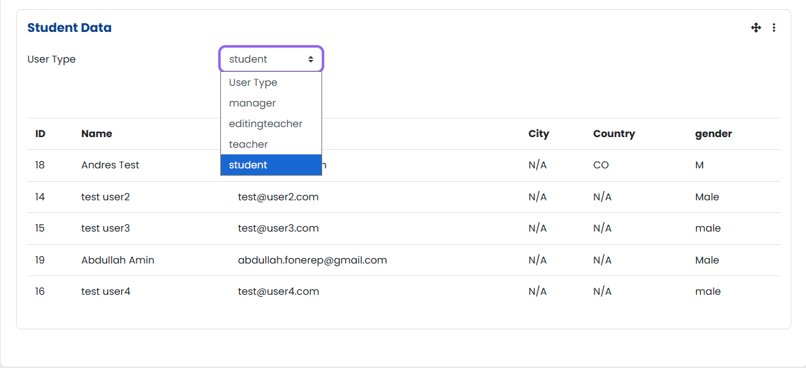

# Student Data Managment Block

A simple block plugin to display all the user profile fields on the dashboard to the users with required permissions mostly admin and managers by default. Works dynamically; any custom profile created will automatically be added in the table.

---

## Installation

You can simply upload the zip file in the **site administration->plugins->install plugins** and then you can have have the option to add the block on the dashboard.

## License

This plugin is licensed under the [GNU GPL v3](http://www.gnu.org/licenses/).

